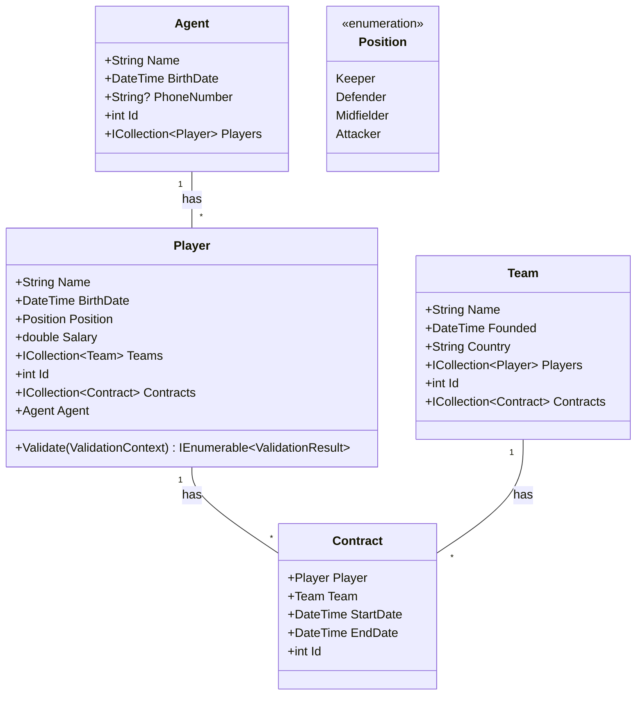

# Project .NET Framework

* Naam: Sami Filjak
* Studentennummer: 015467153
* Academiejaar: 23-24
* Klasgroep: INF201
* Onderwerp: Player agent 1 - * Football Player * - * Football Team 

## Sprint 3

### Beide zoekcriteria ingevuld
```sql
SELECT "p"."Id", "p"."BirthDate", "p"."Name", "p"."Position", "p"."Salary"
FROM "Players" AS "p"
WHERE (@__name_0 = '' OR instr("p"."Name", @__name_0) > 0) AND "p"."BirthDate" = @__birth_Value_1
```

### Enkel zoeken op naam

```sql
SELECT "p"."Id", "p"."BirthDate", "p"."Name", "p"."Position", "p"."Salary"
FROM "Players" AS "p"
WHERE @__name_0 = '' OR instr("p"."Name", @__name_0) > 0
```

### Enkel zoeken op geboortedatum
```sql
SELECT "p"."Id", "p"."BirthDate", "p"."Name", "p"."Position", "p"."Salary"
FROM "Players" AS "p"
WHERE "p"."BirthDate" = @__birth_Value_0
```

### Beide zoekcriteria leeg
```sql
SELECT "p"."Id", "p"."BirthDate", "p"."Name", "p"."Position", "p"."Salary"
FROM "Players" AS "p"
```

## Sprint 4

